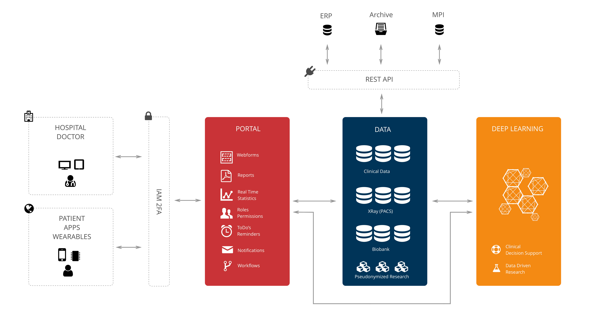

# HealthData.ai Documentation

HealthData.ai is a modular, web-based platform for the structured capture, management, and analysis of health data. It was designed to connect clinical care and research efficiently while meeting high requirements for privacy, security, and scalability.

The platform enables organizations to digitize complex medical processes, capture data in a standardized way, and analyze it in real time. Thanks to its flexible architecture, HealthData.ai can be used in smaller projects as well as large international networks.

Core capabilities include:

- structured data capture using configurable forms
- role-based access control for different user groups
- flexible workflows for mapping medical processes
- real-time analytics and dashboards
- standardized interfaces for data exchange

## HealthData.ai in Numbers

HealthData.ai is designed for use in large and complex environments. The platform supports high numbers of users, institutions, and records and can be adapted flexibly to growing requirements.

Typical deployment scenarios include:

- several thousand to millions of patient records
- international use across multiple institutions
- large volumes of structured and unstructured data
- integration of imaging data and biosamples

This scalability ensures that the platform is suitable for individual hospitals as well as national or international registries.

**[www.healthdata.ai](https://www.healthdata.ai)**

-   :material-rocket-launch-outline:{ .lg .middle } **Clinical Documentation**

    ---

    SOAP-based electronic health records.

    [:octicons-arrow-right-24: Learn more](modules/clinical-documentation.md)

-   :material-database-outline:{ .lg .middle } **Data Collection**

    ---

    Secure multicentre data collection.

    [:octicons-arrow-right-24: Learn more](modules/data-collection.md)

-   :material-flask-outline:{ .lg .middle } **Medical Research**

    ---

    Anonymized clinical data for research.

    [:octicons-arrow-right-24: Learn more](modules/medical-research.md)

-   :material-shield-lock-outline:{ .lg .middle } **Information Security and Data Protection**

    ---

    YubiKey, SSL, AES, ISO 27001.

    [:octicons-arrow-right-24: Learn more](security/index.md)

-   :material-transit-connection-variant:{ .lg .middle } **Interfaces**

    ---

    FHIR, DICOM, REST API.

    [:octicons-arrow-right-24: Learn more](interfaces.md)

-   :material-email-outline:{ .lg .middle } **Contact & Support**

    ---

    Direct contact channels for questions and support.

    [:octicons-arrow-right-24: Contact](about/contact.md)

Doctors and patient devices access the system and authenticate securely using IAM with two-factor authentication. 

Once logged in, they interact with the portal, where they can enter data, view reports, and manage workflows. The portal communicates with a central data layer that stores clinical information, imaging data, biobank records, and pseudonymized research data. 

This data layer also exchanges information with external systems such as ERP and archives through a REST API. At the same time, the stored data is analyzed by deep learning models to generate insights for clinical decision support and research. These insights are then fed back into the portal, where they are presented to users as reports, statistics, and actionable information.